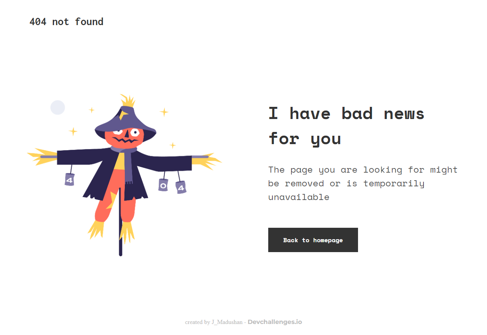

# 404 Error Page Challenge



## Overview

This project is a custom 404 Error Page created as part of a DevChallenges task. It demonstrates a modern, responsive design for handling "Page Not Found" errors, providing a user-friendly experience and clear navigation options.

## Features
- Clean and professional UI
- Responsive layout for desktop and mobile
- Custom graphics and branding
- Clear messaging and call-to-action

## Technologies Used
- HTML5
- CSS3

## Getting Started

To view the 404 Error Page locally:

1. Clone this repository:
   ```zsh
   git clone https://github.com/JanishkaM/404-Error-Page-devchallenges.git
   ```
2. Open `index.html` in your browser.

## Folder Structure
```
index.html
README.md
css/
  style.css
img/
  devchallenges.png
  Scarecrow.png
  screenshot.png
```

## Credits
- Challenge by [DevChallenges](https://devchallenges.io/)
- Images and assets are for demonstration purposes only.

## License
This project is open source and available under the MIT License.

